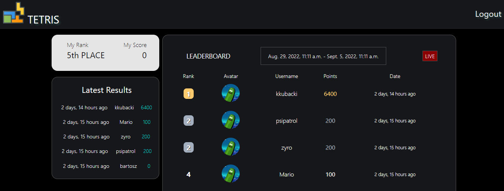
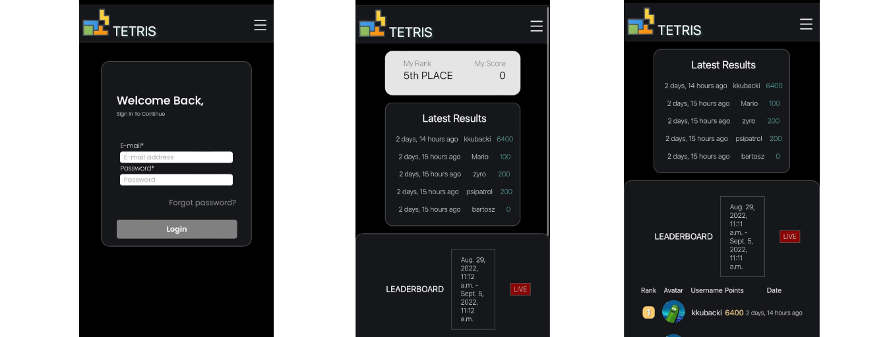

#  Tetris Project
Tetris' game and live online scoreboard.
***

  
  
    
  

# 🧐 Project Structure

**[Backend](/backend/)**:  Django framework based web-server with basic frontend and REST API.

**[Game](/game/)**: Tetris game based on [Pygame library](www.pygame.org/) connected to backend via HTTP Requests.

# 🌟 Demo & Preview
[Tetris demo server](https://desolate-basin-99300.herokuapp.com/)
### Browser: 

***
### Mobile:

# 👨‍ Tech stack
### Here's a brief high-level overview of the tech stack the Tetris Project uses:

      

# ⚠️ License
Tetris using GPL license.