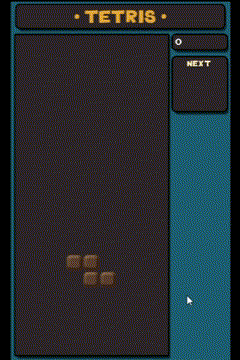

# Tetris Game &middot;  [](https://github.com/xHeler/tetris/actions/workflows/game-linting.yml) 

My tetris game interpretation connected to live time server. [Download now!](https://github.com/xHeler/tetris/releases)
***




# Documentation
You can find the Tetris documentation inside .py files as docstrings.

# Setup & Build
Clone repository.
```sh
git clone https://github.com/xHeler/tetris.git
cd tetris/game
```
Create environment and install dependencies.
```sh
python -m venv .venv
.\.venv\Scripts\activate # windows
source .venv/bin/activate # linux
pip install -r requirements.txt
```
Run a game.
```sh
python -m  src.main
```

# License
Tetris using GPL license.